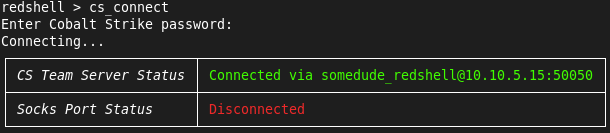
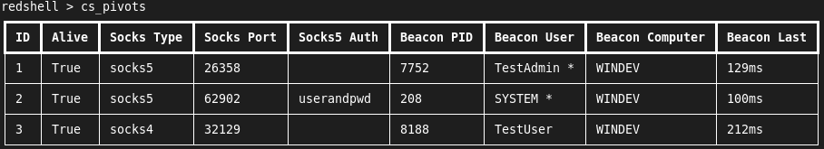

# RedShell
An interactive command prompt for red teaming and pentesting. Automatically pushes commands through proxychains via Cobalt Strike beacon socks proxies or custom proxies. Automatically logs activities on a Cobalt Strike teamserver and/or local files.

# Installation
RedShell runs on Python > 3.8.

Install dependencies:
```
pip3 install -r requirements.txt
```
Install proxychains-ng (https://github.com/rofl0r/proxychains-ng):
```
apt install proxychains4
```
RedShell is no longer dependent on Cobalt Strike. However, if you're using Cobalt Strike integration, the CS client must be installed on the same host as RedShell. Also Make the agscript wrapper executable:
```
chmod +x agscript.sh
```

# Usage
Start RedShell:
```
$ python3 redshell.py 

                ____           _______ __         ____
               / __ \___  ____/ / ___// /_  ___  / / /
              / /_/ / _ \/ __  /\__ \/ __ \/ _ \/ / / 
             / _, _/  __/ /_/ /___/ / / / /  __/ / /  
            /_/ |_|\___/\__,_//____/_/ /_/\___/_/_/

            
RedShell> 

```

Display help:
```
RedShell> help

Documented commands (use 'help -v' for verbose/'help <topic>' for details):
===========================================================================
beacon_exec  cs_connect      cs_status     help        quit 
cd           cs_disconnect   cs_use_pivot  history     set  
config       cs_load_config  exec          proxy_exec  shell
context      cs_pivots       exit          pwd         socks
 
```

Set options:
```
RedShell> set option VALUE
```
## Logging
RedShell automatically logs activities via the `beacon_exec`, `proxy_exec`, or `exec` commands. Logging is automatically initialized on startup, and log files are written to `~/.redshell`.

To log to Cobalt Strike, connect to a team server, select a pivot, and use the `beacon_exec` command.

## Proxies
RedShell uses proxychains-ng and a custom proxychains configuration file. Configuration file modifications and command proxying are handled on-the-fly.

### Cobalt Strike
To proxy through a Cobalt Strike, connect to a team server, select a pivot, and use the `beacon_exec` command. Refer to the Cobalt Strike section for details.

### Custom Proxies
Custom socks version 4 or 5 proxies can be set with the `socks` command.
```
RedShell> socks -h
usage: socks [-h] {socks4,socks5} ip_address socks_port

Use a custom socks4/5 port

positional arguments:
  {socks4,socks5}
  ip_address
  socks_port

optional arguments:
  -h, --help       show this help message and exit
```

## Context
RedShell's context is a key aspect of activity logging. Context allows you to set the perspective (in activity logs) of the source host executing activities in a target network. The following context attributes can included in activity logs: IP Address, DNS Name, NetBIOS Name, User Name, and Process ID. Only IP Address is required.

Notes on context:
 - Context is cleared when you set a new socks port
 - Context is cleared when you connect/disconnect from a CS team server

### Context - Custom Proxies
After you set a socks proxy with the `socks` command, add context details with the `context` command.
```
RedShell> context -h
usage: context [-h] [-d DNSNAME] [-n NETBIOSNAME] [-u USERNAME] [-p PID] ip_address

Set a custom context (Source IP/DNS/NetBIOS/User/PID) for logging

positional arguments:
  ip_address            Source IP Address

optional arguments:
  -h, --help            show this help message and exit
  -d DNSNAME, --dnsname DNSNAME
                        DNS Name
  -n NETBIOSNAME, --netbiosname NETBIOSNAME
                        NetBIOS Name
  -u USERNAME, --username USERNAME
                        User Name
  -p PID, --pid PID     Process ID
```

### Context - Cobalt Strike
If you are using a pivot on a team server, context values are automatically set based on the beacon.

## Execute and Log
The following RedShell commands are captured in activity logs:
 - `beacon_exec` - Execute a command through beacon socks proxy and simultaneously log it to the teamserver.
 - `proxy_exec` - Execute a command through custom socks proxy and simultaneously log it to the local file.
 - `exec` - Execute a command and log it to the local file.

## Custom Proxy Example


## Cobalt Strike
### Connecting to Cobalt Strike

Set Cobalt Strike connection options:
```
RedShell> set cs_host 127.0.0.1
RedShell> set cs_port 50050
RedShell> set cs_user somedude
```

Connect to team server (you will be prompted for the team server password):
```
RedShell> cs_connect 
```
Example:



Or load from a config file. Note: team server passwords are not read from config files. RedShell will prompt for the teamserver password and then automatically connect.
```
$ cat config.txt 
cs_host=127.0.0.1
cs_port=12345
cs_user=somedude
```
```
RedShell> cs_load_config config.txt
```

Show available proxy pivots:
```
RedShell> cs_pivots 
```
Example:



Select a proxy pivot (note: this can only be set after a connection to the team server has been established):
```
RedShell> cs_use_pivot 2
```
Check Cobalt Strike status:
```
RedShell> cs_status
```
Example:


Execute commands through the beacon socks proxy. These can be run in the context of the current user or via sudo. Specifying 'proxychains' in the command is optional. Commands are forced through proxychains. MITRE ATT&CK Tactic IDs are optional. 
```
RedShell> beacon_exec -h
usage: beacon_exec [-h] [-t TTP] ...

Execute a command through beacon socks proxy and simultaneously log it to the teamserver.

positional arguments:
  command            Command to execute through the proxy and log.

optional arguments:
  -h, --help         show this help message and exit
  -t TTP, --ttp TTP  MITRE ATT&CK Tactic IDs. Comma delimited to specify multiple.

example: 
beacon_exec -t T1550.002,T1003.002 cme smb 192.168.1.1 --local-auth -u Administrator -H C713B1D611657D0687A568122193F230 --sam
```
Example:


Note on the Redshell and CS install directory options - the script needs to know where it lives, as well as Cobalt Strike.
If stuff blows up, be sure to set the directories accordingly:
```
RedShell> set redshell_directory /opt/redshell
RedShell> set cs_directory /opt/cobaltstrike
```

## General
Note on passwords used in *exec commands: special characters in passwords may be interpreted as shell meta characters, which could cause commands to fail. To get around this, set the password option and then invoke with '$password'. Example:
```
RedShell> set password Test12345
password - was: ''
now: 'Test12345'
RedShell> beacon_exec cme smb 192.168.1.14 --local-auth -u administrator -p $password --shares
```

RedShell includes commands for navigating the file system:
```
RedShell> cd /opt/redshell/
RedShell> pwd
/opt/redshell
```

Additional commands can be run via the shell command or via the '!' shortcut:
```
RedShell> shell date
Mon 29 Jul 2019 05:33:02 PM MDT
RedShell> !date
Mon 29 Jul 2019 05:33:03 PM MDT
```

Commands are tracked and accessible via the history command:
```
RedShell> history 
    1  load_config config.txt
    2  status
    3  help
```

RedShell also includes tab-completion and clearing the terminal window via ctrl + l.

## CSV Log Format
```
Datetime,IP Address,DNS Name,NetBIOS Name,User,PID,Activity,TTPs
2021/09/21 14:22:32 +0000,192.168.56.106,,WINDEV,USER,7312,[PROXY] cme smb 192.168.56.105,
```

Notes:
- Required fields: Datetime, IP Address, Activity
- Optional fields: DNS Name, NetBIOS Name, User, PID, TTPs
- Datetime format: "%Y/%m/%d %H:%M:%S %z" (UTC)

## Maintainers

 - [exfiltrata](https://github.com/exfiltrata)

## License

This project is licensed under the terms of the Apache 2.0 open source license. Please refer to [LICENSE](LICENSE.md) for the full terms.